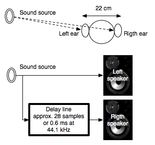

# Utility for micro-decorrelation calculation
Compositional techniques programmed as Max patches.

Programming 
Antonio de SOUSA DIAS 
a.sousadias@belasartes.ulisboa.pt

## Description:
This Max/MSP patch was first programmed in 2007 and it is inspired by the works of Horacio Vagione, namely the text _Décorrélation microtemporelle, morphologies et figurations spatiales_. 
It is provided to observe the perceptive effects of temporal de-correlation, hoping to contribute to the understanding of the relationship between a sound delay and its percetual effect. 
Example: 
In the figure below, to simulate a perceptual effect of source location at left, a 22 cm value will give us the number of samples needed to set the desired delay on the right channel. 

## Operation Mode
Setup is straightforward. Use the _asd.decorrelation.maxhelp_ patch to test and play around. 
Enjoy.

## Patch List
- asd.decorrelation.maxhelp - main patch help.
- asd.decorrelation.maxpat - main patch.
- pan2X.maxpat - stereo pan patch
- source.maxpat - audio file player

## References
Vaggione, H. Décorrélation microtemporelle, morphologies et figurations spatiales. Actes des neuvièmes Journées d’Informatique Musicale, Marseille, ADERIM-GMEM, 2002.
http://jim.afim-asso.org/jim2002/articles/L27_Vaggione.pdf.

## Revision history
- 2018, December 29: Initial release on GitHub.
- 2007: design and programming.

### Disclaimer:
These patches are distributed in the hope that they will be useful, but WITHOUT ANY WARRANTY; without even the implied warranty of MERCHANTABILITY or FITNESS FOR A PARTICULAR PURPOSE.

Faculdade de Belas-Artes, 
Universidade de Lisboa 
Largo da Academia Nacional de Belas-Artes 
1249-058 Lisboa, Portugal 
http://www.belasartes.ulisboa.pt/

www.sousadias.com
